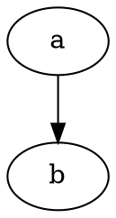

# Articles

REPL [Sessions](/doc/sessions.md) are great, but aren't always the appropriate pedagogical tool, especially when much explaining is required.

Frequently it'd be better to interleave examples with fully formatted text.
This lets authors build their narrative while taking the greatest advantage of available formatting, while still being precise where precision is possible about the inputs outputs and results of evaluation.

Once documentation is in a rich data form, applying syntax highlighting and IDE-like code analysis becomes quite tractable.
Furthermore, the documentation itself becomes somewhat decoupled from its final rendering.

### Demo: Article parsing

[**example.md**](/src/test/resources/example.md)

    # Primordial Clojure {#primordial}

    ```clj+session {#ex1}
    ---
    {:namespace user
     :session "primordial"}
    ---
    user> (def foo 3)
    #'user/foo
    ```

    Some continued text in the middle of the example, and now
    we want to continue the same session with another example

    ```clj+session {#ex2}
    ---
    {:session "primordial"}
    ---
    user> (+ foo 3)
    6
    ```

```clj+session
---
{:namespace user
 :eval true}
---
> (require '[stacks.tools.articles :refer [parse-article handle-parse-block]])
> (require '[clojure.java.io :as io])
> (parse-article handle-parse-block
   (io/resource "example.md"))
```

## Embedded content

Articles also support more general content embedding, including syntax highlighting and even full rendering of nested documents.
The precise mechanism here is a work in progress - I want to stay as close to possible to standard Markdown syntax, rather than introduce a whole new preprocessor language ala Liquid.

### Demo: Embedded basic syntax highlighting

Nested content is supported not just as sessions, but with syntax highlighting.
So long as the `{highlight=false}` option isn't set on a code block, if it isn't otherwise handled it will be rendered with Pygments if at all possible.
For instance, rendering some Python -

```py
def foo(x: int, y: int):
  return x + y
```

### Demo: Embedded graph

Not only is highlighting of nested content supported, but full rendering is also supported.
Language processors may choose to provide a `{render=true}` behavior for compiling rather than simply highlighting the code block.
This provides a native alternative to traditional Makefile based workflows for compiling artifacts.

For instance, Shelving has a middelware for GraphViz (which happens to not have a Pygments language yet) which does full rendering to inline SVG.


