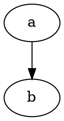

# Articles

[REPL Sessions](/doc/sessions.md) are an excellent tool for illustrating specific examples, but aren't always the appropriate pedagogical tool.
Comments are a poor medium within which to format more than simple statements, and they break the flow of the REPL session as an interactive session.

Rather than trying to embed much explaining textually within a REPL session, it's better to think of the REPL session itself as an illustration within a larger explanation or document context, say interleave examples within fully formatted text.

This lets authors build their narrative while taking the greatest advantage of available formatting, while still being precise where precision is possible about the inputs outputs and results of evaluation.

This is the role which Articles aim to fill - they aim to augment the widely adopted Markdown (technically [CommonMark](http://commonmark.org/)) formatting language with convenient facilities for embedding more than just static examples.

Articles and their components can be processed with the CommonMark tools to produce a data representation not unlike a Hiccup tree.
This allows the use of custom rendering features for embedded content such as sessions, as well as static document analysis.
Say spellchecking, automated cross linking between documents and soforth.

### Demo: Article parsing
Take for example [**example.md**](/src/test/resources/example.md) from the test suite - included literally here.

    # Primordial Clojure {#primordial}

    ```clj+session {#ex1}
    ---
    {:namespace user
     :session "primordial"}
    ---
    user> (def foo 3)
    #'user/foo
    ```

    Some continued text in the middle of the example, and now
    we want to continue the same session with another example

    ```clj+session {#ex2}
    ---
    {:session "primordial"}
    ---
    user> (+ foo 3)
    6
    ```

If we run that text through the article parser, we get back a datastructure consisting of the union of a Hiccup tag tree with some other structures, representing the sessions in the text.
See the [Sessions](/doc/sessions.md) for more on what sessions can do.

```clj+session
---
{:namespace user
 :eval true}
---
> (require '[stacks.tools.articles :refer [parse-article handle-parse-block]])
> (require '[clojure.java.io :as io])
> (parse-article handle-parse-block
   (io/resource "example.md"))
```

## Embedded content

Articles also support more general content embedding, including syntax highlighting and even full rendering of nested documents.
The precise mechanism here is a work in progress - I want to stay as close to possible to standard Markdown syntax, rather than introduce a whole new preprocessor language ala Liquid.

### Demo: Embedded basic syntax highlighting

Nested content is supported not just as sessions, but with syntax highlighting.
So long as the `{highlight=false}` option isn't set on a code block, if it isn't otherwise handled it will be rendered with Pygments if at all possible.
For instance, rendering some Python -

```py
def foo(x: int, y: int):
  return x + y
```

### Demo: Embedded graph

Not only is highlighting of nested content supported, but full rendering is also supported.
Language processors may choose to provide a `{render=true}` behavior for compiling rather than simply highlighting the code block.
This provides a native alternative to traditional Makefile based workflows for compiling artifacts.

For instance, Shelving has a middelware for GraphViz (which happens to not have a Pygments language yet) which does full rendering to inline SVG.


